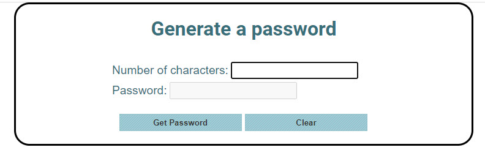
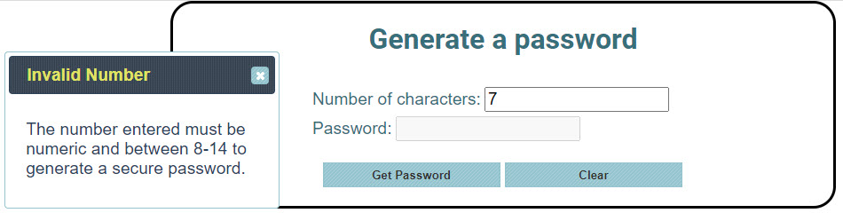
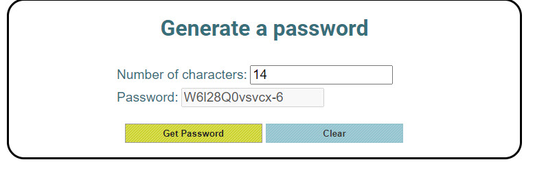

# WEB-233 W12A01 Password Generator with Random Numbers and Strings

___

For this assignment, you will get an opportunity to implement an algorithm using Random Number and String functions to generate a password using jQuery.  All UI elements used should be jQuery UI widgets.

### Project Overview

___

When the Password Generator application is rendered, it should resemble the following screen shot:

When an invalid number is entered for the Number of Characters.

When a number is entered between the range of 8 and 14, then a password is generated as shown below.

For this assignment, you must:

1. Implement a function to handle random numbers based on a number that is passed into this multi-use function.

2. In the document ready function add provisions for the generate button click event.  In this function:
    - Define a lowcase constant which contains all lowercase letters.  
    - Define an upcase constant which contains all uppercase letters.  
    - Define a numbers constant which contains all digits from 0 to 9.
    - Define a specialChar constant which contains the following string value, i.e., "$&()*+[]@#^-_!?".
    - Retrieve the number of characters value from the textbox.
    - Validate to ensure that the value is numeric and between 8 and 14 inclusive.  If the entry is not valid, provide a meaningful message in a jQuery UI Dialog.
    - For a valid number entry, use this value as a loop control.  Within the loop,:
        - Call the Random Function passing in the number of categories (4) that were defined as constants above.
        - Based on the value returned (depending on whether you add 1 to the value returned from the random function, the range returned will be 0-3)
        - If the value of the category selected using the random value is 0, then:
            - Call the random function using the length of the lowcase constant.
            - Use the returned value as an index to get the character at that index location in the string and assign this to a variable passwordChar.
        - If the value of the category selected using the random value is 1, then:
            - Call the random function using the length of the upcase constant.
            - Use the returned value as an index to get the character at that index location in the string and assign this to a variable passwordChar.
        - If the value of the category selected using the random value is 2, then:
            - Call the random function using the length of the numbers constant.
            - Use the returned value as an index to get the character at that index location in the string and assign this to a variable passwordChar.
        - If the value of the category selected using the random value is 3, then:
            - Call the random function using the length of the specialChar constant.
            - Use the returned value as an index to get the character at that index location in the string and assign this to a variable passwordChar.
        - Concatenate the passwordChar that was selected based on the category to the password value.

2. In the document ready function add provisions for the clear button click event.  In this function:
    - Clear the textbox fields for the Number of Characters and the password fields.
    - Reset the focus to the Number of Characters textbox.

3. Ensure initial focus when the form is presented is set to the Number of Characters textbox.

### Grading Criteria
| Criteria                                                                                          | Total Points Assignment |
|---------------------------------------------------------------------------------------------------|-------------------------|
| Added div for error dialog to html file.                                                          | 1                       |
| Implemented the Random Number Function in generate password button click function.                | 5                       |
| Defined a lowcase constant with all lowercase letters in generate password button click function. | 1                       |
| Defined an upcase constant with all uppercase letters in generate password button click function. | 1                       |
| Defined an numbers constant with all digits, 0 through 9 in generate password button click function. | 1
| Define a special char constant which contains the special characters indicated in the assignment in the generate password button click function. | 1
| This criterion is linked to a Learning OutcomeValidates that number of characters is numeric and in range. If not vald, then a jQuery dialog should be displayed. | 4
| Random function called to retrieve which category to use for character selection. | 2
| Random function called to retrieve the character from the relevant string constant based on prior random call. | 2
| Retrieves the character from string using the correct string function. | 2
| Character was appended to the Password field which is displayed in the textbox. | 2
| Text boxes are cleared in the Clear button click function. | 2
| Focus set on the Number of characters field initially on form load and also in the Clear button click function. | 1

### Commit Changes to Remote GitHub Repository
___

1. Post your lab work to the remote GitHub repository after reviewing the Assignment Rubric in Eagle.  Follow the instructions for committing changes in the **_Getting Started With GitHub_** documentation posted in the **_Reference Document_** in the "Welcome to the Course" module in RVC Eagle.
